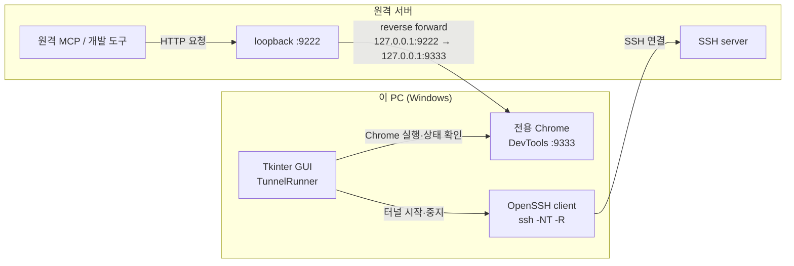
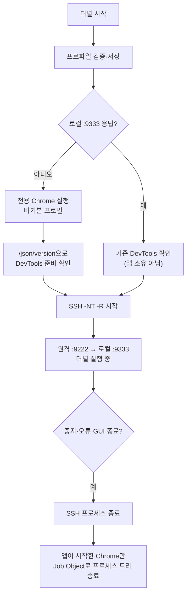

# _forAI Guide

## 목차

- [한 줄 요약](#한-줄-요약)
- [읽는 순서](#읽는-순서)
- [문서 역할](#문서-역할)
- [현재 스냅샷](#현재-스냅샷)
- [SSH 역터널 구조](#ssh-역터널-구조)
- [Tkinter GUI](#tkinter-gui)
- [유지 규칙](#유지-규칙)

## 한 줄 요약

이 디렉터리는 `ready_chromedev` 작업을 이어받을 때 필요한 AI 작업 문맥을 정리해 두는 곳이다.
저장소의 범위는 **`chrome-devtools-mcp` 설치·확인과 원격 서버에서 로컬 Chrome에 접속하는
SSH 역터널의 실행·관리**다.

## 읽는 순서

1. `README.md`
2. `inventory.md`
3. `memo.md`  ← **등록 스코프와 로드 시점이 여기 있다. 제일 중요하다.**
4. `dev_log.md`
5. `plan.md`

## 문서 역할

- `inventory.md`: 저장소에 실제로 있는 구조와 확인 명령을 기록한다.
- `plan.md`: 앞으로 진행할 작업과 미결 항목만 기록한다.
- `memo.md`: 스코프, 로드 시점, 기본값, 디버깅 교훈 같은 참고 메모를 모은다.
- `dev_log.md`: 날짜별 작업 이력을 남긴다.

## 현재 스냅샷

- 저장소 경로: `c:\works\ready_chromedev`
- git: 브랜치 `main`
- 구성: `.mcp.json` · `.codex/config.toml` · `readme.md` · 정적 데모 파일 · `tunnel_gui/` ·
  `_forAI/`
- 플랫폼: Windows 11 Home 26200 / Node v24.18.0 / Chrome 150.0.7871.115 / Claude Code 2.1.193
- MCP: Claude Code는 project scope, Codex는 user/global scope로 `chrome-devtools`를 등록
- 터널 GUI: `tunnel_gui/` 독립 uv 프로젝트 / Python 3.14.6 / Tk 8.6.14 / PyYAML 6.0.3

## SSH 역터널 구조



Windows PC가 `ssh -R 127.0.0.1:9222:127.0.0.1:9333 Host별칭` 연결을 시작한다.
원격 서버의 MCP나 도구는 `127.0.0.1:9222`에 접속하고, SSH가 요청을 이 PC의
`127.0.0.1:9333` Chrome DevTools로 전달한다. `9222`는 원격 서버의 loopback에만 열리므로
외부 네트워크에 직접 노출되지 않는다.

## Tkinter GUI

```powershell
cd C:\works\ready_chromedev\tunnel_gui
uv sync
uv run python -m chrome_tunnel_gui
```



- `tunnel_gui/chrome_tunnel_gui/tunnel.py`: Chrome 실행·DevTools 확인·SSH `-R`·프로세스 정리를 담당한다.
- `tunnel_gui/chrome_tunnel_gui/profiles.py`: `profiles.yaml`의 프로파일 저장·선택·삭제를 담당한다.
- `tunnel_gui/chrome_tunnel_gui/app.py`: Tkinter 입력·상태·로그·AI 협업 문장과 프로파일 UI를 담당한다.
- PowerShell 스크립트는 사용하지 않는다. Windows Job Object로 앱이 시작한 전용 Chrome 프로세스 트리를
  중지 시 종료한다.
- `~/.ssh/config`에 `Host gblab-dgx-01`이 있으면 GUI의 `SSH Host 별칭`에 `gblab-dgx-01`을
  입력한다. IP를 `user@IP` 형태로 직접 전달하면 해당 별칭 블록의 `IdentityFile`이 적용되지 않는다.
- GUI 종료 시 자신이 시작한 SSH와 전용 Chrome 프로세스 트리도 종료한다. 시작 전에 있던 Chrome은 건드리지 않는다.
- 원격 서버에서 `curl http://127.0.0.1:9222/json/version`으로 최종 연결을 확인한다.
- 대화형 SSH 암호 입력은 지원하지 않는다. 키 또는 `ssh-agent` 인증을 사용하고 최초 호스트 키는
  터미널에서 미리 승인한다.

## 유지 규칙

- 계획이 아닌 참고 정보는 `plan.md`가 아니라 `memo.md`에 둔다.
- 저장소 구조나 실행 명령이 바뀌면 `inventory.md`를 먼저 갱신한다.
- 작업 이력은 날짜를 붙여 `dev_log.md`에만 남긴다.
- 모든 문서에는 제목 바로 아래에 `## 목차` 섹션을 둔다.
- **주장에는 근거를 붙인다.** 이 저장소의 사실은 웹 검색이 아니라 실행해서 얻었다.
  검증 안 한 것은 "미검증"이라고 명시한다.
- **범위를 넓히지 않는다.** 강의안, 방법론 비교, 데모 코드는 이 저장소의 것이 아니다.
  필요하면 커밋 `cd8c714` 에서 꺼낸다.
- 사용자 동의 없이 git commit을 하지 않는다.
- 사용자 동의 없이 `_forAI/` 문서를 수정하지 않는다.
