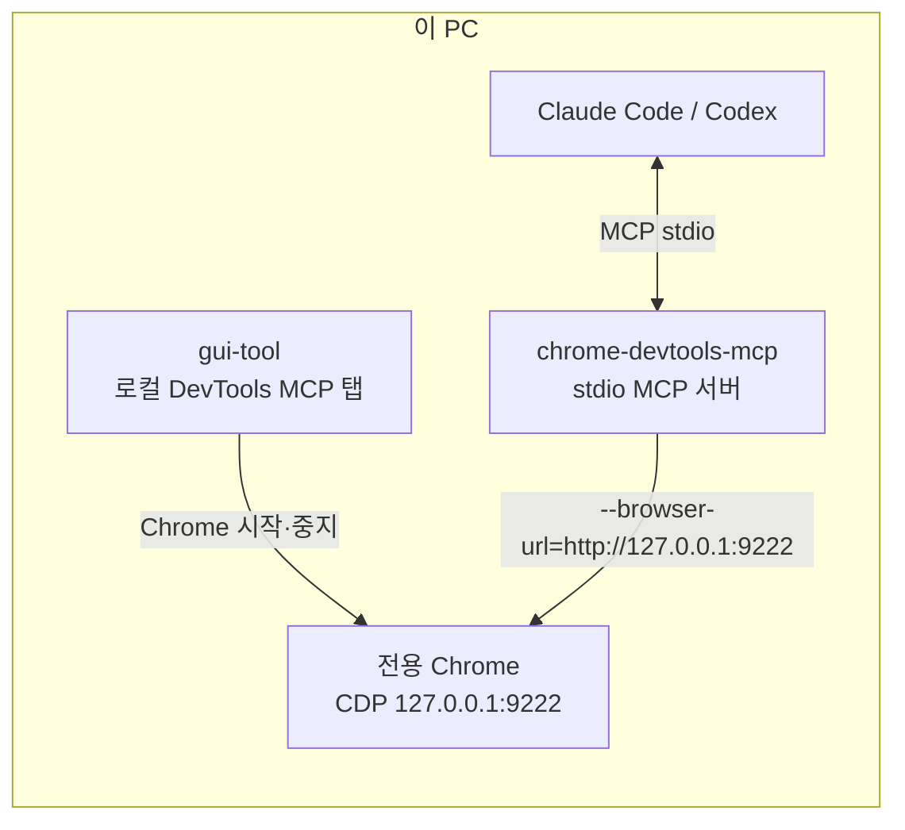
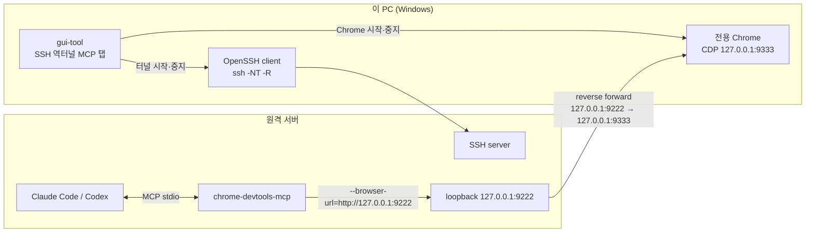
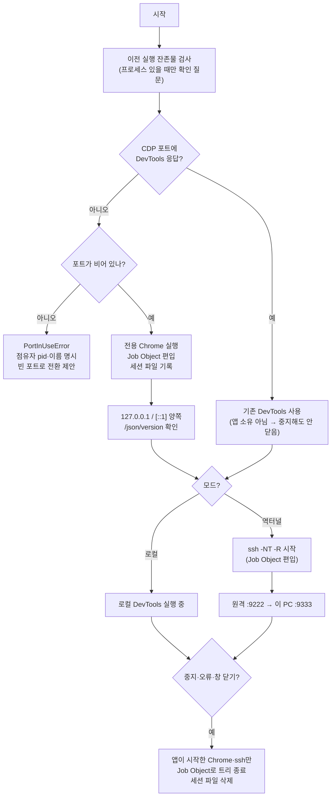
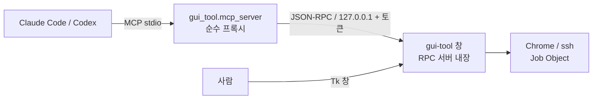

# _forAI Guide

## 목차

- [한 줄 요약](#한-줄-요약)
- [읽는 순서](#읽는-순서)
- [문서 역할](#문서-역할)
- [현재 스냅샷](#현재-스냅샷)
- [로컬 DevTools MCP 구조](#로컬-devtools-mcp-구조)
- [SSH 역터널 구조](#ssh-역터널-구조)
- [gui_tool](#gui_tool)
- [AI와 창을 함께 쓰기](#ai와-창을-함께-쓰기)
- [유지 규칙](#유지-규칙)

## 한 줄 요약

이 디렉터리는 `ready_chromedev` 작업을 이어받을 때 필요한 AI 작업 문맥을 정리해 두는 곳이다.
저장소의 범위는 **`chrome-devtools-mcp` 설치·확인과, MCP가 붙을 Chrome CDP 엔드포인트를
준비하는 일**이다. 엔드포인트는 두 가지다 — 같은 PC의 로컬 CDP, 그리고 원격 서버에서 이 PC의
Chrome에 접속하는 SSH 역터널.

## 읽는 순서

1. `README.md`
2. `inventory.md`
3. `memo.md`  ← **등록 스코프와 로드 시점이 여기 있다. 제일 중요하다.**
4. `dev_log.md`
5. `plan.md`

## 문서 역할

- `inventory.md`: 저장소에 실제로 있는 구조와 확인 명령을 기록한다.
- `plan.md`: 앞으로 진행할 작업과 미결 항목만 기록한다.
- `memo.md`: 스코프, 로드 시점, 기본값, 디버깅 교훈 같은 참고 메모를 모은다.
- `dev_log.md`: 날짜별 작업 이력을 남긴다.

## 현재 스냅샷

- 저장소 경로: `c:\works\ready_chromedev`
- git: 브랜치 `main`
- 구성: `.mcp.json` · `.codex/config.toml` · `readme.md` · 정적 데모 파일 · `gui_tool/` ·
  `_forAI/`
- 플랫폼: Windows 11 Home 26200 / Node v24.18.0 / Chrome 150.0.7871.130 / Claude Code 2.1.193
- MCP: `.mcp.json`에 **두 개** 등록 — `chrome-devtools`(Chrome 조작)와 `gui-tool`(창 조작 브리지).
  Codex는 user/global scope로 `chrome-devtools`를 등록
- GUI: `gui_tool/` 독립 uv 프로젝트 0.4.0 / Python 3.11.15 / Tk 8.6 / PyYAML

> `tunnel_gui/`는 2026-07-21 삭제되고 `gui_tool/`로 대체되었다. 옛 이름과
> `chrome_tunnel_gui` 패키지를 참조하는 문서·명령은 더 이상 동작하지 않는다.

## 로컬 DevTools MCP 구조

같은 PC에서 AI 클라이언트, `chrome-devtools-mcp`, Chrome이 모두 실행된다.



## SSH 역터널 구조



Windows PC가 `ssh -R 127.0.0.1:9222:127.0.0.1:9333 Host별칭` 연결을 시작한다.
원격 서버의 MCP는 `127.0.0.1:9222`에 접속하고, SSH가 요청을 이 PC의 `127.0.0.1:9333`
Chrome DevTools로 전달한다. `9222`는 원격 서버의 loopback에만 열리므로 외부에 노출되지 않는다.

## gui_tool

```powershell
cd C:\works\ready_chromedev\gui_tool
uv sync
uv run gui-tool
```



- `gui_tool/src/gui_tool/devtools.py`: Chrome·ssh 실행, Job Object, CDP 확인, 포트 충돌 판정.
- `gui_tool/src/gui_tool/cleanup.py`: 세션 소유권 기록과 이전 실행 잔존물 회수.
- `gui_tool/src/gui_tool/profiles.py`: `profiles.yaml`의 프로파일 저장·선택·삭제.
- `gui_tool/src/gui_tool/app.py`: Tkinter 두 탭, 상태·로그·AI 전달용 연결 정보.
- PowerShell 스크립트는 사용하지 않는다. **Chrome과 ssh 모두** Job Object에 넣으므로,
  앱이 정상 종료하든 크래시하든 작업 관리자로 강제 종료되든 자식 트리까지 함께 정리된다.
- `~/.ssh/config`에 `Host gblab-dgx-01`이 있으면 GUI의 `SSH 대상`에 별칭을 그대로 넣는다.
  `user@IP` 형태로 직접 전달하면 그 별칭 블록의 `IdentityFile`이 적용되지 않는다.
- 원격 서버에서 `curl http://127.0.0.1:9222/json/version`으로 최종 연결을 확인한다.
- 대화형 SSH 암호 입력은 지원하지 않는다. 키 또는 `ssh-agent` 인증을 사용하고 최초 호스트 키는
  터미널에서 미리 승인한다.

## AI와 창을 함께 쓰기

GUI는 실행되는 동안 **자기 프로세스 안에서** JSON-RPC 2.0 서버를 연다. 사람이 보는 그 창을
AI가 그대로 조작하는 것이 목적이므로 서버를 별도 프로세스로 빼지 않는다 — 그러면 Job Object
소유권이 GUI와 분리되어 "같은 인스턴스"라는 전제가 깨진다.



- 접속 정보는 `%TEMP%\ready-chromedev-rpc-<pid>.json`. 포트 임의 배정, 토큰은 매 실행 새로 생성.
- 브리지는 살아 있는 창 중 가장 최근 것에 붙는다. 창이 없으면 **대신 띄우지 않고**
  "먼저 `uv run gui-tool`을 실행하라"고 답한다.
- 도구 7개: `gui_tool_status` / `start` / `stop` / `cleanup` / `log` / `profiles` /
  `select_profile`.
- 이 구조는 앞으로 만드는 GUI 협업 툴의 표준이다. 근거와 규칙은 `memo.md`의
  [GUI 협업 툴 구조] 절에 있다.

## 유지 규칙

- 계획이 아닌 참고 정보는 `plan.md`가 아니라 `memo.md`에 둔다.
- 저장소 구조나 실행 명령이 바뀌면 `inventory.md`를 먼저 갱신한다.
- 작업 이력은 날짜를 붙여 `dev_log.md`에만 남긴다.
- 모든 문서에는 제목 바로 아래에 `## 목차` 섹션을 둔다.
- **주장에는 근거를 붙인다.** 이 저장소의 사실은 웹 검색이 아니라 실행해서 얻었다.
  검증 안 한 것은 "미검증"이라고 명시한다.
- **범위를 넓히지 않는다.** 강의안, 방법론 비교, 데모 코드는 이 저장소의 것이 아니다.
  필요하면 커밋 `cd8c714` 에서 꺼낸다.
- 사용자 동의 없이 git commit을 하지 않는다.
- 사용자 동의 없이 `_forAI/` 문서를 수정하지 않는다.
