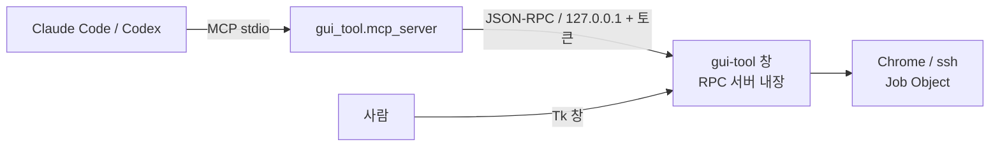

# Inventory

## 목차

- [Repository](#repository)
- [Top-level structure](#top-level-structure)
- [설정 파일](#설정-파일)
- [gui_tool](#gui_tool)
- [확인 명령](#확인-명령)
- [Tests](#tests)
- [Notes](#notes)

## Repository

- Name: `ready_chromedev`
- Path: `c:\works\ready_chromedev`
- git: 브랜치 `main`.
- Summary: **`chrome-devtools-mcp` 등록·확인과, MCP가 붙을 Chrome CDP 엔드포인트 준비 저장소.**

## Top-level structure

```
.mcp.json     Claude Code용 chrome-devtools MCP 서버 등록 (project scope).
.codex/       Codex 프로젝트 설정 예시.
readme.md     MCP 설치·확인법과 gui_tool 사용법.
index.html    삼목 데모 진입점.
style.css     데모 스타일.
script.js     데모 동작.
gui_tool/     독립 Python·uv·Tkinter CDP 엔드포인트 관리자.
_forAI/       이 문서 세트.
.gitignore    node_modules/, _archive/, .venv/, .claude/, Python 캐시
```

`tunnel_gui/`는 2026-07-21 삭제되었다. 대체물이 `gui_tool/`이다.

## 설정 파일

`.mcp.json` — 서버 **두 개**를 등록한다.

```json
{
  "mcpServers": {
    "chrome-devtools": {
      "command": "cmd",
      "args": ["/c", "npx", "-y", "chrome-devtools-mcp@latest"]
    },
    "gui-tool": {
      "command": "cmd",
      "args": ["/c", "uv", "--directory", "C:\\works\\ready_chromedev\\gui_tool",
               "run", "python", "-m", "gui_tool.mcp_server"]
    }
  }
}
```

- `chrome-devtools`: Chrome을 실제로 조작하는 MCP. 준비된 CDP 주소에 붙는다.
- `gui-tool`: **실행 중인 gui-tool 창**에 붙는 얇은 브리지. 창이 없으면 대신 띄우지 않고
  "먼저 `uv run gui-tool`을 실행하라"고 답한다. 자세한 구조는 아래 [gui_tool](#gui_tool) 참고.
- **project scope.** 이 폴더를 루트로 연 세션에서만 읽힌다.
- 첫 사용 전 **승인**이 필요하다. 승인 기록은 `.claude/settings.local.json` 에 남고,
  그 디렉터리는 `.gitignore` 에 있다.
- Windows 에서 `cmd /c` 래핑은 **필수**다. Claude Code 는 셸 없이 `spawn()` 하므로
  `"command": "npx"` 는 `spawn npx ENOENT` 로 죽는다.

Codex 전역 등록:

- Windows: `codex mcp add chrome-devtools -- cmd /c npx -y chrome-devtools-mcp@latest`
- macOS·Ubuntu: `codex mcp add chrome-devtools -- npx -y chrome-devtools-mcp@latest`
- 저장 위치: `~/.codex/config.toml` (`CODEX_HOME`을 설정했으면 그 경로)
- Codex 전역 등록은 상위 폴더를 VS Code 작업 루트로 열어도 MCP를 쓰기 위한 의도적인 결정이다.

## gui_tool

독립 uv 프로젝트. 패키지명 `chrome-devtools-gui-tool` 0.4.0, 콘솔 엔트리포인트
`gui-tool` → `gui_tool.app:main`. src 레이아웃이며 `.python-version`은 3.11이다.

```
gui_tool/
├─ .python-version      3.11
├─ README.md
├─ pyproject.toml       hatchling, 의존성은 pyyaml 하나
├─ uv.lock
├─ profiles.yaml        역터널 프로파일. **git 추적 대상이 아니다**(`.gitignore`).
│                       SSH 대상이 들어가므로 커밋하지 않고, 첫 실행 때 기본값으로 생성된다.
├─ src/gui_tool/
│  ├─ app.py            Tkinter 두 탭, 이벤트 펌프, 생명주기, 정리 UI, RPC 표면
│  ├─ devtools.py       DevToolsConfig, Chrome·ssh 실행, Job Object, CDP 확인, PortInUseError
│  ├─ cleanup.py        세션 소유권 기록, pid 신원 확인, 잔존물 회수
│  ├─ rpc.py            GUI 내장 JSON-RPC 2.0 서버, TkDispatcher, 엔드포인트 파일
│  ├─ mcp_server.py     AI용 stdio MCP 브리지 (순수 프록시, 로직 없음)
│  ├─ profiles.py       profiles.yaml 원자적 저장소
│  └─ __main__.py
└─ tests/               test_tunnel.py, test_profiles.py, test_cleanup.py, test_rpc.py
```

### AI와 창을 함께 쓰는 구조



- **RPC 서버는 GUI 프로세스 안에 있다.** Job Object는 그것을 만든 프로세스와 수명을 같이하므로,
  서버를 밖으로 빼면 "사람이 보는 창과 AI가 조작하는 대상이 같다"는 전제가 깨진다.
- 접속 정보: `%TEMP%\ready-chromedev-rpc-<pid>.json`. 포트는 임의 배정, 토큰은 매 실행 새로
  만든다. 브리지는 **살아 있는 창 중 가장 최근 것**에 붙고, 죽은 소유자의 파일은 지운다.
- 노출 도구 7개: `gui_tool_status` / `start` / `stop` / `cleanup` / `log` / `profiles` /
  `select_profile`.
- AI 경로 규칙 둘. **모달 대화상자를 띄우지 않는다**(사람 없는 경로에서 창이 멈춘다).
  **포트를 임의로 바꾸지 않는다**(`--browser-url`은 MCP 서버 시작 시점에 고정되므로 포트가
  바뀌면 이미 붙은 연결이 끊긴다). 포트 전환은 사람이 창에서 확인할 때만 한다.

두 탭:

| 탭 | 이 PC CDP | MCP가 연결할 주소 | SSH |
|:--|:--|:--|:--|
| 로컬 DevTools MCP | `9222` | `http://127.0.0.1:9222` | 사용 안 함 |
| SSH 역터널 MCP | `9333` | 원격 `http://127.0.0.1:9222` | `-R 127.0.0.1:9222:127.0.0.1:9333` |

- 기본 원격 대상: 백엔드 `192.168.0.220:8000`, SSH Host 별칭 `gblab-dgx-01`.
  별칭을 사용해야 `~/.ssh/config`의 `id_ed25519_myservers`가 적용된다.
- Python 외부 의존성은 PyYAML 하나다. 런타임은 uv 관리 Python 3.11.15 / Tk 8.6.
- SSH 인증은 키 또는 비대화형 `ssh-agent`가 필요하다. stdin이 닫혀 있어 암호 프롬프트를 못 쓴다.
- **Chrome과 ssh 모두** Windows Job Object(`JOB_OBJECT_LIMIT_KILL_ON_JOB_CLOSE`)에 넣는다.
  앱이 죽는 방식과 무관하게 자식 트리까지 정리된다. 시작 전부터 포트를 쓰던 Chrome은
  앱 소유가 아니므로 종료하지 않는다.
- 잔존물 회수: 실행 중 `%TEMP%\ready-chromedev-session-<포트>.json`에 소유 pid·이미지·생성
  시각을 기록하고, 다음 실행에서 대조해 확인된 것만 `taskkill /T /F`로 정리한다. 세션 기록이
  없는 경우에는 Restart Manager로 전용 프로파일 폴더를 쥔 chrome.exe를 찾아 회수한다.

## 확인 명령

```powershell
# 1) npx 캐시 예열 + 실제로 받아오는 버전 (셸을 거치는 경로)
npx -y chrome-devtools-mcp@latest --version     # 2026-07-09 기준 1.5.0

# 2) 등록/연결 헬스체크 — 반드시 이 저장소를 루트로
claude mcp list                                 # chrome-devtools: ✔ Connected

# 3) Codex 전역 등록 확인 — 어느 폴더에서나
codex mcp list                                  # chrome-devtools ... enabled

# 4) gui_tool 테스트
Set-Location .\gui_tool
uv sync
uv run python -m unittest discover -s tests -v  # 2026-07-22 기준 52개 통과
uv run python -m compileall -q src tests

# 5) GUI 실행
uv run gui-tool

# 6) 로컬 CDP 확인
curl http://127.0.0.1:9222/json/version

# 7) MCP 브리지 단독 확인 (창이 없으면 안내 메시지를 isError로 돌려준다)
'{"jsonrpc":"2.0","id":1,"method":"tools/list"}' | uv run python -m gui_tool.mcp_server
```

세션 안에서는 `/mcp` 로 본다. **`claude mcp list` 와 `/mcp` 는 다른 것을 본다.**
전자는 별도 프로세스를 새로 띄워 헬스체크하고, 후자는 현재 세션의 실제 상태를 보여준다.
`claude mcp list` 가 초록이어도 현재 세션에 도구가 없을 수 있다 (2026-07-09 실측).

## Tests

- `codex mcp list`에서 `chrome-devtools`가 `enabled`인지 확인한다.
- `gui_tool`에서 `uv run python -m unittest discover -s tests -v`를 실행한다.
- `gui_tool`에서 `uv run python -m compileall -q src tests`를 실행한다.
- 테스트는 프로세스를 실제로 죽이지 않는다. `cleanup` 테스트는 pid 재사용 시나리오를
  생성 시각 위조로 만들고, 종료 함수는 patch로 막아 호출되지 않음을 단언한다.

## Notes

- `package.json`은 없다. `npx`는 Chrome DevTools MCP가 필요할 때만 네트워크를 쓴다.
- `gui_tool` Python 의존성은 PyYAML 하나이며, `uv.lock`으로 고정한다.
- `@latest` 를 쓰므로 버전이 조용히 올라간다. 도구 개수·이름은 `/mcp` 로 확인할 것.
- 2026-07-09 저장소를 대폭 축소했다. `demo/`, `scripts/`, `slides/`, `docs/` 삭제.
  삭제 직전 상태는 커밋 `cd8c714` 에 전부 들어 있다. 필요하면 거기서 꺼낸다.
- 2026-07-14 Codex 전역 등록은 스크립트 대신 `codex mcp add` 한 줄 명령으로 문서화했다.
- 2026-07-21 `tunnel_gui/`를 `gui_tool/`로 대체했다. 옛 `chrome_tunnel_gui` 패키지를
  참조하는 명령은 동작하지 않는다.
