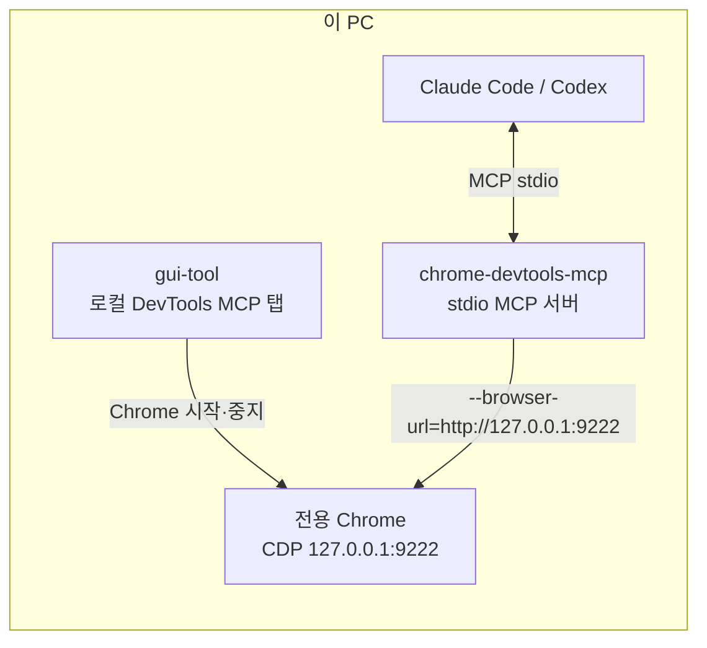
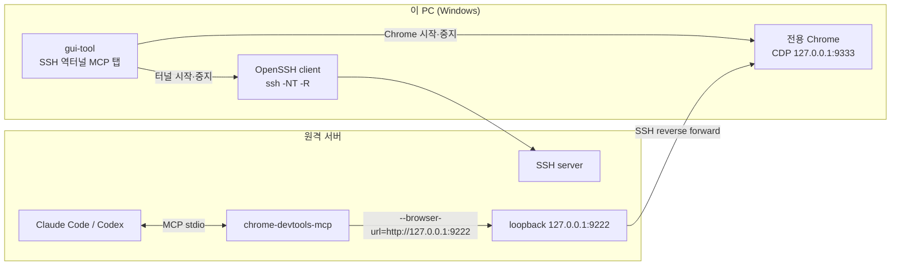
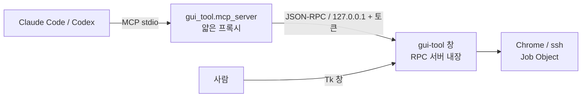

# DevTools MCP GUI Tool

이 저장소의 중심인 `chrome-devtools-mcp`가 사용할 Chrome CDP 엔드포인트를 준비하는 Python·Tkinter
GUI입니다. 로컬 실행은 단순 기본값으로, SSH 역터널은 프로파일로 관리하며 두 탭이 로그·종료 정책을
공유합니다. PowerShell 스크립트를 호출하지 않습니다.

GUI가 MCP 서버 자체를 실행하지는 않습니다. Claude Code나 Codex가 `chrome-devtools-mcp`를 stdio
서버로 실행하고, MCP의 `--browser-url` 인자가 GUI에서 준비한 CDP 주소를 가리키는 구조입니다.
개발·실행 Python 버전은 `.python-version`에 지정한 3.11을 사용합니다.

## 탭과 MCP 연결 구조

### 로컬 DevTools MCP 탭

같은 PC에서 AI 클라이언트, `chrome-devtools-mcp`, Chrome이 모두 실행됩니다. GUI는 전용 Chrome을
`127.0.0.1:9222`에 열고, MCP는 그 주소에 직접 연결합니다. 시작 URL의 기본값은
`http://localhost:8000/`이며 SSH 및 역터널 프로파일을 사용하지 않습니다.



```text
chrome-devtools-mcp --browser-url=http://127.0.0.1:9222
```

### SSH 역터널 MCP 탭

GUI가 이 PC의 Chrome CDP를 준비하고 `ssh -R`을 시작합니다. 원격 서버에서 실행되는 MCP는 원격
loopback 포트 `127.0.0.1:9222`에 연결하며, CDP 트래픽은 SSH를 거쳐 이 PC의 Chrome으로 전달됩니다.



```text
원격 서버: chrome-devtools-mcp --browser-url=http://127.0.0.1:9222
SSH: -R 127.0.0.1:9222:127.0.0.1:9333
```

역터널에서는 원격 MCP가 `9222`에 연결하고, SSH가 이를 이 PC의 터널 전용 Chrome CDP `9333`으로
전달합니다.

| 탭 | GUI 입력 | MCP가 연결할 주소 |
|:--|:--|:--|
| 로컬 DevTools MCP | 로컬 웹 호스트·포트, Chrome CDP 포트 | `http://127.0.0.1:9222` |
| SSH 역터널 MCP | 역터널 프로파일, 이 PC CDP `9333`, SSH 대상, 원격 CDP `9222` | 원격 서버의 `http://127.0.0.1:9222` |

두 탭 모두 앱이 직접 시작한 전용 Chrome만 Windows Job Object로 종료한다. 시작 전에 열려 있던
Chrome DevTools는 사용은 가능하지만 앱이 종료하지 않는다. SSH 프로세스도 같은 Job Object 정책을
따르므로, 앱이 정상 종료하든 크래시하든 작업 관리자로 강제 종료되든 함께 정리된다.

## AI와 창을 함께 쓰기 (RPC + MCP)

GUI는 실행되는 동안 **자기 프로세스 안에서** JSON-RPC 2.0 서버를 연다. 별도 프로세스로 빼지
않는 이유는 명확하다 — Chrome과 ssh를 붙잡은 Job Object는 그것을 만든 프로세스와 수명을
같이하므로, 서버가 GUI 밖으로 나가는 순간 "사람이 보는 창과 AI가 조작하는 대상이 같다"는
전제가 깨진다.



접속 정보는 `%TEMP%\ready-chromedev-rpc-<pid>.json`에 쓴다. 포트는 임의 배정이고 토큰은
매 실행 새로 만든다. `%TEMP%`는 사용자 전용 경로이며 서버는 `127.0.0.1`에만 바인딩한다.
브리지는 이 파일을 읽어 **살아 있는 창 중 가장 최근 것**에 붙는다. 창이 없으면 대신 띄우지
않고 "먼저 `uv run gui-tool`을 실행하라"고 답한다.

`.mcp.json`에 등록하면 AI가 다음 도구를 쓴다.

| 도구 | 하는 일 |
|:--|:--|
| `gui_tool_status` | 현재 탭·실행 여부·`browser_url`·마지막 오류 |
| `gui_tool_start` | Chrome(+역터널) 시작. 기본적으로 실행될 때까지 대기 |
| `gui_tool_stop` | 앱이 시작한 것만 중지 |
| `gui_tool_cleanup` | 잔존물 조회(기본) / `apply=true`일 때만 정리 |
| `gui_tool_log` | 실행 로그 끝부분 |
| `gui_tool_profiles` · `gui_tool_select_profile` | 역터널 프로파일 |

AI 경로에는 두 가지 규칙이 있다.

- **모달 대화상자를 띄우지 않는다.** 사람이 없는 경로에서 대화상자가 뜨면 창이 멈추고 호출자는
  영문도 모른 채 기다린다. RPC로 시작한 실행의 오류는 `status`의 `last_error`로 읽어 간다.
- **포트를 임의로 바꾸지 않는다.** `chrome-devtools-mcp`의 `--browser-url`은 서버 시작 시점에
  고정되므로, 포트가 바뀌면 이미 붙어 있는 MCP 연결이 끊긴다. 포트가 점유되어 있으면 점유자를
  명시한 오류를 그대로 반환하고, 전환은 사람이 창에서 확인할 때만 한다.

## 남은 프로세스 정리

앱은 실행 중에 `%TEMP%\ready-chromedev-session-<포트>.json`에 소유권 증거를 남긴다. 여기에는
자신의 pid와 함께, 시작한 Chrome·ssh의 pid·이미지 이름·**프로세스 생성 시각**이 들어간다.
Windows는 pid를 빠르게 재사용하므로 pid만으로는 소유권 근거가 되지 못한다. 생성 시각까지
일치할 때만 앱이 시작한 그 프로세스로 인정한다.

시작할 때 자동으로 한 번 검사해 찾은 항목을 로그에 적는다. **남은 프로세스가 있을 때만**
정리할지 물어보고, 묻지 않고 바로 종료하지는 않는다. 프로세스 없이 폴더만 남은 경우에는
로그에만 적는다 — 매 실행마다 묻는 것은 성가시고, 전용 프로파일에는 로그인 상태가 들어 있을 수
있기 때문이다. 폴더까지 지우려면 `남은 프로세스 정리` 버튼을 쓴다.

정리 대상은 다음 조건을 모두 만족하는 것뿐이다.

- 세션 파일을 만든 GUI 프로세스가 이미 죽어 있다. 살아 있는 다른 창의 Chrome은 건드리지 않는다.
- 기록된 pid가 아직 같은 이미지·같은 생성 시각이다. 재사용된 pid는 종료 직전에 다시 확인해 건너뛴다.
- 전용 프로파일 폴더 `%TEMP%\ready-chromedev-chrome-<포트>` 중 살아 있는 세션이 없는 것.

프로세스 트리는 `taskkill /T /F`로 끝낸다. 이미 실행 중인 프로세스를 새 Job Object에 넣어도
**이미 태어난** 자식은 소급해서 딸려오지 않기 때문이다.

## 포트 충돌

CDP 포트를 이미 다른 프로세스가 쓰고 있으면 Chrome은 `127.0.0.1` 대신 `[::1]`로 물러나 바인딩하고,
그러면 `--browser-url=http://127.0.0.1:<포트>`는 연결되지 않는다. 그래서 앱은 Chrome을 띄우기 전에
포트를 먼저 확인한다. CDP 확인은 `127.0.0.1`과 `[::1]`을 모두 시도하며, 응답 본문에 `Browser`
키가 있을 때만 Chrome DevTools로 인정한다.

포트가 점유되어 있으면 앱은 TCP 테이블에서 **점유 프로세스의 이름과 pid를 찾아 오류에 명시**하고,
그것이 앱 소유인지(세션 기록 또는 전용 프로파일 폴더 사용 여부로 판정)를 함께 알려 준다.

- 앱 소유가 아니면: 그 프로세스는 종료하지 않고, 비어 있는 포트를 찾아 **바꿔서 다시 시작할지**
  물어본다. 예: 이 PC처럼 다른 Chrome이 `127.0.0.1:9222`를 계속 잡고 있는 환경에서는 한 번의
  확인으로 `9223`으로 옮겨 시작된다.
- 앱 소유 잔존물이면: 정리 후 같은 포트로 다시 시작할지 물어본다.

중지 직후 곧바로 다시 시작하는 경우의 일시적 포트 점유는 3초까지 재시도한 뒤에만 오류로 처리한다.

## 실행

```powershell
cd C:\works\ready_chromedev\gui_tool
uv sync
uv run gui-tool
```

모듈 실행이 필요한 경우에는 다음 표준 실행법도 사용할 수 있습니다.

```powershell
uv run python -m gui_tool
```

`pyproject.toml`의 `[project.scripts]`가 `gui-tool` 명령을 `gui_tool.app:main`에 연결하므로,
일반적인 사용에서는 콘솔 엔트리포인트를 권장합니다.

## 디렉터리 구조

```text
gui_tool/
├─ .python-version      # uv가 사용할 Python 버전
├─ README.md            # 이 문서
├─ pyproject.toml       # 프로젝트 메타데이터, 의존성, gui-tool 엔트리포인트
├─ uv.lock              # 재현 가능한 의존성 잠금 파일
├─ src/gui_tool/
│  ├─ app.py            # Tkinter UI, 이벤트 펌프, 생명주기, RPC 표면
│  ├─ devtools.py       # Chrome·ssh 실행, Job Object, CDP 확인
│  ├─ cleanup.py        # 세션 소유권 기록과 남은 프로세스 회수
│  ├─ rpc.py            # GUI 내장 JSON-RPC 서버, Tk 스레드 디스패처
│  ├─ mcp_server.py     # AI용 stdio MCP 브리지 (순수 프록시)
│  └─ profiles.py       # profiles.yaml 저장소
├─ tests/               # 표준 unittest 테스트
└─ profiles.yaml        # SSH 역터널 프로파일. git 추적 대상이 아니며
                        # 처음 실행할 때 기본값으로 만들어진다 (SSH 대상이 들어가므로)
```

## 프로파일

`profiles.yaml`은 SSH 역터널 탭에서만 사용한다. 로컬 탭은 별도 프로파일 없이 `localhost:8000`과
Chrome CDP `9222`를 기본값으로 사용한다. 역터널의 시작 주소는 `기본 시작 URL 호스트`와 포트로
만들고, 둘 다 비어 있으면 `about:blank`를 연다.

```yaml
version: 1
active_profile: dgx-01
profiles:
  dgx-01:
    backend_host: 192.168.0.220
    backend_port: 8000
    ssh_target: gblab-dgx-01
    chrome_debug_port: 9333
    remote_debug_port: 9222
    chrome_profile: ''
```

로컬 탭에는 프로파일 UI와 SSH 인자가 나타나지 않는다. 역터널 탭의 `ssh_target`에는
`~/.ssh/config` 별칭 또는 `user@host` 형식을 입력한다.

## 확인

```powershell
uv run python -m unittest discover -s tests -v
uv run python -m compileall -q src tests
```

로컬 모드는 이 PC에서 다음 주소로 확인한다.

```powershell
curl http://127.0.0.1:9222/json/version
```

역터널 모드는 원격 서버에서 다음 주소로 확인한다.

```bash
curl http://127.0.0.1:9222/json/version
```

## 보안

- DevTools와 원격 포트는 모두 `127.0.0.1`에만 바인딩한다.
- 역터널 모드는 `BatchMode=yes`를 사용하므로 SSH 키 또는 비대화형 `ssh-agent` 인증이 필요하다.
- 개인 기본 프로필 대신 전용 Chrome 프로필을 권장한다.
- `chrome-devtools-mcp`는 연결된 브라우저의 페이지와 인증 상태를 읽고 조작할 수 있다.
- YAML에는 비밀번호나 private key 내용을 저장하지 않는다.
