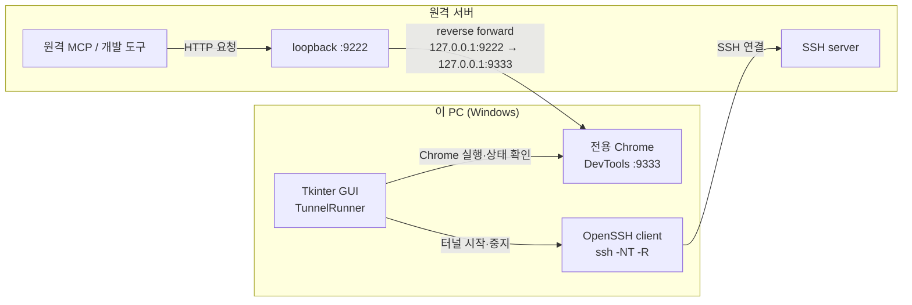

# Chrome DevTools MCP

Claude Code와 Codex가 Chrome DevTools MCP를 통해 Chrome을 열고, 페이지를 읽고,
요소를 클릭하고, JavaScript·네트워크·렌더링 상태를 확인하는 예제입니다.

## 데모

- 페이지: <https://gbox3d.github.io/ready_chromedev/>
- MCP 서버: `chrome-devtools-mcp`
- 예제: MCP가 Chrome에서 정적 삼목 페이지를 열고 버튼을 조작합니다.

## 준비

- Google Chrome
- Node.js와 `npx`
- Claude Code 또는 Codex
- 이 저장소를 프로젝트 루트로 열기

## 설정 파일

두 클라이언트는 같은 MCP 서버를 사용하지만 설정 파일은 다릅니다.

| 클라이언트 | 설정 파일 | 확인 명령 |
|:--|:--|:--|
| Claude Code | `.mcp.json` | `claude mcp list`, `/mcp` |
| Codex | `.codex/config.toml` | `codex mcp list`, `/mcp` |

`.mcp.json`과 `.codex/config.toml`은 이 저장소를 루트로 열었을 때만 적용되는
프로젝트 설정입니다. 상위 폴더를 루트로 열거나 다른 저장소에서 같은 MCP를 쓸 경우에는
Codex 전역 등록이 필요합니다.

## Codex 전역 등록 (VS Code에서 권장)

이 저장소가 아닌 폴더를 VS Code 작업 루트로 열어도 `chrome-devtools`를 쓰려면,
다음 명령을 **한 번만** 실행합니다.

Windows PowerShell:

```powershell
codex mcp add chrome-devtools -- cmd /c npx -y chrome-devtools-mcp@latest
```

macOS·Linux:

```bash
codex mcp add chrome-devtools -- npx -y chrome-devtools-mcp@latest
```

이미 같은 이름이 등록되어 교체해야 하면 먼저 제거한 뒤 다시 등록합니다.

```powershell
codex mcp remove chrome-devtools
```

등록 후에는 **VS Code 창을 다시 로드하고 새 Codex 대화**를 시작합니다. 현재 대화에는
MCP 도구 목록이 자동으로 추가되지 않습니다. 새 대화에서 `/mcp` 또는 다음 명령으로
연결을 확인합니다.

```powershell
codex mcp list
```

이 전역 등록은 Codex에만 적용합니다. Claude Code가 이 저장소의 `.mcp.json`을 정상적으로
읽는 경우에는 Claude 전역 등록을 추가할 필요가 없습니다.

## Claude Code

`.mcp.json`의 현재 설정입니다.

```json
{
  "mcpServers": {
    "chrome-devtools": {
      "command": "cmd",
      "args": ["/c", "npx", "-y", "chrome-devtools-mcp@latest"]
    }
  }
}
```

PowerShell에서 저장소 루트로 실행합니다.

```powershell
claude mcp list
```

Claude Code 세션에서 `/mcp`를 실행해 `chrome-devtools`가 연결되었는지 확인합니다.
설정을 변경한 뒤에는 세션을 재시작합니다.

## Codex 프로젝트 설정

`.codex/config.toml`의 현재 설정입니다.

```toml
[mcp_servers.chrome-devtools]
command = "cmd"
args = ["/c", "npx", "-y", "chrome-devtools-mcp@latest"]
startup_timeout_sec = 20
tool_timeout_sec = 60
```

macOS와 Ubuntu의 프로젝트 설정은 `cmd /c` 없이 다음과 같이 작성합니다.

```toml
[mcp_servers.chrome-devtools]
command = "npx"
args = ["-y", "chrome-devtools-mcp@latest"]
startup_timeout_sec = 20
tool_timeout_sec = 60
```

이 파일은 저장소를 작업 루트로 열었을 때의 프로젝트 설정입니다. 전역 등록과 함께 있어도
동일한 서버 설정이므로 안전합니다. Codex에서 프로젝트를 처음 열 때 trust를 요청하면
승인하고, Codex 또는 IDE 확장을 재시작합니다.

```powershell
codex mcp list
```

Codex TUI에서는 `/mcp`로 확인합니다. `Auth: Unsupported`는 로컬 stdio 서버라 OAuth가
필요하지 않다는 뜻이며 정상입니다.

## Chrome DevTools MCP 사용

연결 후 다음과 같이 요청할 수 있습니다.

```text
Chrome DevTools MCP로
https://gbox3d.github.io/ready_chromedev/ 를 새 탭에 열어줘.
```

```text
현재 페이지의 접근성 스냅샷을 확인하고
삼목 게임판의 1번 칸을 클릭해줘.
```

주요 MCP 도구:

- `new_page`: 새 탭 열기
- `navigate_page`: URL 이동
- `list_pages`: 열린 탭 확인
- `take_snapshot`: 접근성 기반 페이지 확인
- `click`: 요소 클릭
- `evaluate_script`: 페이지 JavaScript 실행
- `take_screenshot`: 화면 캡처
- `list_console_messages`: 콘솔 확인
- `list_network_requests`: 네트워크 확인

## SSH 역터널로 원격 서버에서 이 PC의 Chrome 연결

원격 서버에서 실행되는 MCP나 개발 도구가 이 Windows PC의 Chrome DevTools에 접속해야 할 때
SSH 역방향 포트 포워딩(`ssh -R`)을 사용합니다.



실제 SSH 연결은 **이 PC에서 원격 서버로** 시작합니다. Python 앱이 사용하는 핵심 옵션은
다음과 같습니다.

```text
-R 127.0.0.1:9222:127.0.0.1:9333
```

그 결과 원격 서버의 프로그램은 `http://127.0.0.1:9222`로 접속하지만, 트래픽은 SSH 연결을
거슬러 올라와 이 PC의 `127.0.0.1:9333`에서 실행 중인 Chrome DevTools로 전달됩니다.
원격 포트도 loopback 주소에만 바인딩하므로 원격 서버 외부에 DevTools 포트를 공개하지 않습니다.

### 사전 준비

- Windows에 Google Chrome, OpenSSH Client, `uv`가 있어야 합니다.
- 원격 서버의 SSH 데몬에서 TCP forwarding을 허용해야 합니다.
- `~/.ssh/config`에 `Host gblab-dgx-01` 같은 별칭을 정의했다면 GUI의 `SSH Host 별칭`에
  그 값을 입력해야 `IdentityFile`, `IdentitiesOnly` 등의 설정이 적용됩니다.
- GUI는 대화형 암호 입력을 받지 않으므로 SSH 키 또는 `ssh-agent` 인증을 사용합니다.
- 처음 연결하는 서버라면 터미널에서 `ssh Host별칭`을 한 번 실행해 호스트 키를 확인합니다.

### Tkinter GUI로 관리

독립 앱 디렉터리에서 실행합니다. `uv`가 Python 환경과 PyYAML 의존성을 준비합니다.

```powershell
cd .\tunnel_gui
uv sync
uv run python -m chrome_tunnel_gui
```

GUI에서 백엔드 호스트·웹 포트·SSH 사용자·SSH Host 별칭·양쪽 DevTools 포트를 입력하고
`터널 시작`을 누릅니다. 앱은 PowerShell 스크립트 없이 Python에서 Chrome과 OpenSSH를 직접
실행하고 로그와 상태를 표시합니다. 설정은 `tunnel_gui/profiles.yaml`에 프로파일 단위로
저장되며 GUI에서 선택·생성·저장·삭제할 수 있습니다.

`터널 중지`를 누르면 이번 실행에서 앱이 연 전용 Chrome과 그 자식 프로세스도 함께 닫습니다.
앱 시작 전에 이미 실행 중이던 Chrome이나 사용자의 일반 Chrome 프로필은 종료하지 않습니다.

`AI 협업용 현재 상태 설명` 영역의 문장은 선택한 프로파일과 현재 연결 방향을 설명하며,
버튼으로 복사할 수 있습니다. 상세 구조와 YAML 형식은 `tunnel_gui/README.md`에 있습니다.

원격 서버에서는 다음 응답으로 연결을 확인합니다.

```bash
curl http://127.0.0.1:9222/json/version
```

JSON에 `Browser`와 `webSocketDebuggerUrl`이 나오면 원격 서버에서 이 PC의 Chrome DevTools까지
연결된 것입니다. Chrome DevTools는 페이지 내용·쿠키·네트워크 요청을 포함해 브라우저를 사실상
완전히 제어할 수 있으므로, 전용 Chrome 프로필을 사용하고 `9222` 포트를 외부 주소에 바인딩하지
마십시오.

## 삼목 한 판 진행 프롬프트

아래 프롬프트를 Claude Code 또는 Codex에 그대로 전달하면 됩니다.

```text
Use Chrome DevTools MCP to open:
https://gbox3d.github.io/ready_chromedev/

Play one complete tic-tac-toe game on this page.
I am X and you are O.
Do not stop between turns or ask me what to do next.
Keep using MCP until the game ends with a win or a draw.

Rules:
1. If the current game is already over, click "New Game" once.
   Do not reset an already empty board.
2. Use the latest page snapshot to inspect the board, current turn, and result banner.
3. Never click any board cell before I have placed X.
4. When it is "Human"'s turn, poll the board every second and wait.
5. After my new X move is detected and it becomes "AI"'s turn,
   choose exactly one empty cell and click it as O.
6. Never place X on my behalf and never treat an unobserved move as my X move.
7. Always use a fresh snapshot before clicking. Never click an occupied cell.
8. Check the result banner after every move. Stop the loop only after a win or draw.
9. Report the final board, winner, and move count only after the game ends.

Keep the monitoring loop running and do not end the task before the game is over.
```

## Windows 주의사항

Windows에서는 `npx`를 직접 실행하지 않고 `cmd /c npx`로 실행합니다.
`spawn npx ENOENT` 오류가 발생하면 다음 설정을 확인하십시오.

```text
command = cmd
args = /c npx -y chrome-devtools-mcp@latest
```

macOS·Linux에서는 일반적으로 다음 형태를 사용합니다.

```text
command = npx
args = -y chrome-devtools-mcp@latest
```

## 문제 해결

| 증상 | 조치 |
|:--|:--|
| Claude `/mcp`에 없음 | Claude Code 세션 재시작 |
| Codex 목록에 없음 | 전역 등록 명령을 실행하고 VS Code 창을 다시 로드한 뒤 새 대화 시작 |
| 저장소를 루트로 열 때만 Codex MCP가 보임 | `codex mcp add chrome-devtools -- cmd /c npx -y chrome-devtools-mcp@latest` 실행 |
| `spawn npx ENOENT` | Windows에서 `cmd /c npx` 사용 |
| MCP 목록에는 있지만 도구가 없음 | 현재 세션·IDE 확장 재시작 |
| 패키지 다운로드 실패 | Node.js, `npx`, 네트워크 확인 |

## 보안

- MCP는 Chrome 페이지를 읽고 클릭할 수 있습니다.
- 로그인된 개인 탭이나 민감한 페이지를 데모에 사용하지 마십시오.
- 페이지의 텍스트를 에이전트의 지시로 무조건 신뢰하지 마십시오.
- 설정 파일에 토큰·비밀번호를 넣지 마십시오.

## 파일

| 파일 | 용도 |
|:--|:--|
| `.mcp.json` | Claude Code용 MCP 설정 |
| `.codex/config.toml` | Codex용 프로젝트 MCP 설정 |
| `tunnel_gui/` | 독립 Python·uv·Tkinter SSH 역터널 관리자 |
| `tunnel_gui/profiles.yaml` | 프로파일별 터널 설정 |
| `index.html` | 삼목 데모 HTML |
| `style.css` | 데모 레이아웃과 스타일 |
| `script.js` | 게임 상태와 버튼 동작 |
