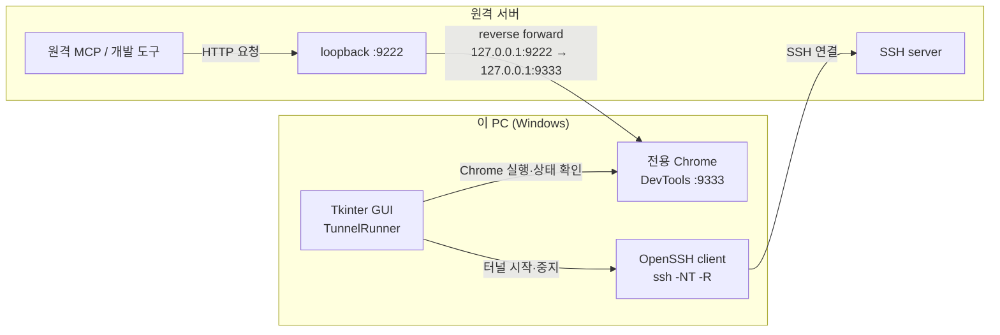

# Chrome DevTools SSH Tunnel GUI

Python, Tkinter, uv로 실행되는 독립형 Chrome DevTools SSH 역터널 관리자입니다.
PowerShell 스크립트를 호출하지 않습니다.

## 구조



Windows PC가 SSH 연결을 시작하고, 원격 서버의 loopback 포트를 이 PC의 Chrome DevTools
포트로 전달합니다. SSH Host 별칭을 사용하면 `~/.ssh/config`의 `IdentityFile`, `User`,
`IdentitiesOnly` 설정이 그대로 적용됩니다.

## 실행

```powershell
cd C:\works\ready_chromedev\tunnel_gui
uv sync
uv run python -m chrome_tunnel_gui
```

호환 런처로도 실행할 수 있습니다.

```powershell
uv run python .\chrome_devtools_tunnel_gui.py
```

## 프로파일 관리

설정은 `profiles.yaml`에 저장합니다. GUI에서 다음 작업을 할 수 있습니다.

- 프로파일 선택 및 불러오기
- 현재 설정 저장
- 현재 설정을 복제한 새 프로파일 생성
- 프로파일 삭제(마지막 하나는 삭제 불가)
- `터널 시작` 시 현재 프로파일 자동 저장

기본 구조:

```yaml
version: 1
active_profile: dgx-01
profiles:
  dgx-01:
    backend_host: 192.168.0.220
    backend_port: 8000
    ssh_user: gblab-dgx-01
    ssh_host: gblab-dgx-01
    chrome_debug_port: 9333
    remote_debug_port: 9222
    chrome_profile: ''
```

`ssh_host`가 비어 있으면 `ssh_user@backend_host`를 사용합니다. `ssh_host`가 있으면 그 값을
OpenSSH에 그대로 전달하므로 `~/.ssh/config`의 같은 `Host` 블록이 적용됩니다.

`chrome_profile`이 비어 있으면 다음과 같은 전용 경로를 사용합니다.

```text
%TEMP%\ready-chromedev-chrome-9333
```

## Python 구현 범위

- Chrome 실행 파일 탐색
- 전용 Chrome 프로필 및 원격 디버깅 포트 실행
- `/json/version`으로 DevTools 준비 확인
- OpenSSH `ssh -NT -R` 프로세스 시작·종료
- 앱이 시작한 전용 Chrome 프로세스 트리 종료
- 실시간 상태와 로그 표시
- AI 협업용 현재 상태 문장 생성 및 클립보드 복사
- YAML 프로파일의 원자적 저장

## 확인

```powershell
uv run python -m unittest discover -s tests -v
uv run python -m compileall -q chrome_tunnel_gui chrome_devtools_tunnel_gui.py
```

원격 서버에서 터널을 확인합니다.

```bash
curl http://127.0.0.1:9222/json/version
```

## 보안

- 원격 DevTools 포트는 `127.0.0.1`에만 바인딩합니다.
- GUI는 `BatchMode=yes`를 사용하므로 SSH 키 또는 비대화형 인증이 필요합니다.
- 개인용 기본 Chrome 프로필보다 별도 전용 프로필을 권장합니다.
- YAML에는 비밀번호나 private key 내용을 저장하지 않습니다.
